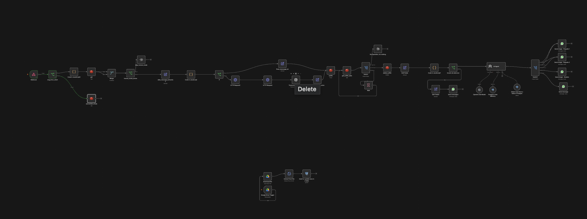
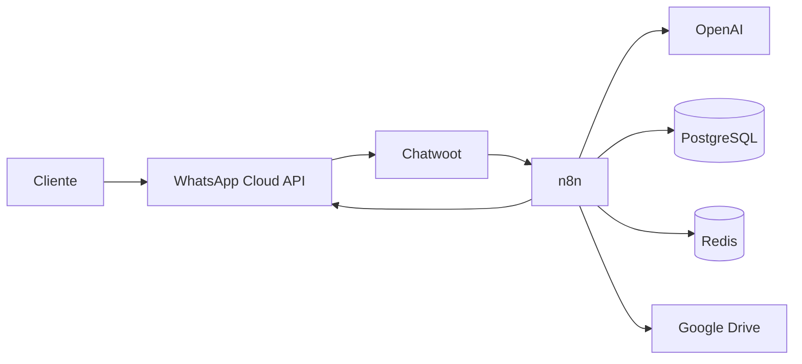

# Plataforma de atención automatizada con WhatsApp, IA y n8n

Documentación técnica y operativa de una plataforma que recibe conversaciones de WhatsApp, permite intervención humana desde Chatwoot y automatiza respuestas mediante n8n, OpenAI, PostgreSQL y Redis.

El repositorio se originó como parte de un proyecto de estadía profesional y está preparado para facilitar mantenimiento, transferencia de conocimiento y futuras implementaciones.

> [!IMPORTANT]
> Este repositorio contiene plantillas y un workflow de ejemplo saneado. Antes de usarlo en producción debes configurar credenciales, dominios, políticas de privacidad y versiones de imágenes validadas.



## Funciones principales

- Recepción y envío de mensajes mediante WhatsApp Cloud API.
- Gestión de conversaciones y atención humana mediante Chatwoot.
- Procesamiento de texto y notas de voz.
- Buffer de mensajes y Human Handoff mediante Redis.
- Respuestas asistidas por IA y memoria conversacional.
- Consulta y sincronización de datos empresariales en PostgreSQL.
- Despliegue con Docker Compose y HTTPS mediante Caddy.

## Arquitectura



Consulta la explicación completa en [Arquitectura](docs/arquitectura.md).

## Inicio rápido

Requisitos:

- VPS con Ubuntu Server 24.04 LTS o distribución compatible.
- Docker Engine y Docker Compose v2.
- Dos dominios apuntando al servidor.
- Cuentas de WhatsApp Cloud API, OpenAI y Google Drive.

```bash
cp .env.example .env
cp docker/docker-compose.yml.example docker/docker-compose.yml
```

Después:

1. Reemplaza todos los valores `CHANGE_ME` de `.env`.
2. Revisa las versiones de imágenes y prueba la actualización en un entorno no productivo.
3. Desde la raíz, valida con `docker compose --env-file .env -f docker/docker-compose.yml config`.
4. Inicia con `docker compose --env-file .env -f docker/docker-compose.yml up -d`.
5. Importa [el workflow saneado](workflows/atencion-whatsapp-principal.example.json).
6. Crea y asigna las credenciales dentro de n8n.
7. Ejecuta el [plan de pruebas](docs/pruebas.md) antes de activar el workflow.

La guía detallada está en [Instalación](docs/instalacion.md).

## Documentación

| Documento | Propósito |
|---|---|
| [Descripción general](docs/overview.md) | Alcance, objetivos y límites |
| [Arquitectura](docs/arquitectura.md) | Componentes, flujos y decisiones |
| [Componentes](docs/componentes.md) | Responsabilidad de cada servicio |
| [Workflows](docs/workflows.md) | Flujo principal y sincronización |
| [Base de datos](docs/base-de-datos.md) | Tablas, índices y datos |
| [Human Handoff](docs/human-handoff.md) | Activación, TTL y recuperación |
| [Credenciales](docs/credenciales.md) | Variables y secretos requeridos |
| [Instalación](docs/instalacion.md) | Preparación y puesta en marcha |
| [Despliegue](docs/despliegue.md) | Topología y procedimiento de release |
| [Operación](docs/operacion.md) | Tareas de administración |
| [Pruebas](docs/pruebas.md) | Casos de aceptación |
| [Seguridad](docs/seguridad.md) | Protección de datos y respuesta a incidentes |
| [Respaldos](docs/respaldo-restauracion.md) | Backup y recuperación |
| [Solución de problemas](docs/troubleshooting.md) | Diagnóstico de fallas frecuentes |
| [Estado del proyecto](docs/estado-proyecto.md) | Madurez, pendientes y riesgos |
| [Referencias](docs/referencias.md) | Documentación oficial y versiones |

## Estructura del repositorio

```text
.
├── docker/       Plantillas de infraestructura y esquema inicial
├── docs/         Documentación técnica y operativa
├── images/       Capturas y diagramas
└── workflows/    Exportaciones de n8n sin credenciales
```
