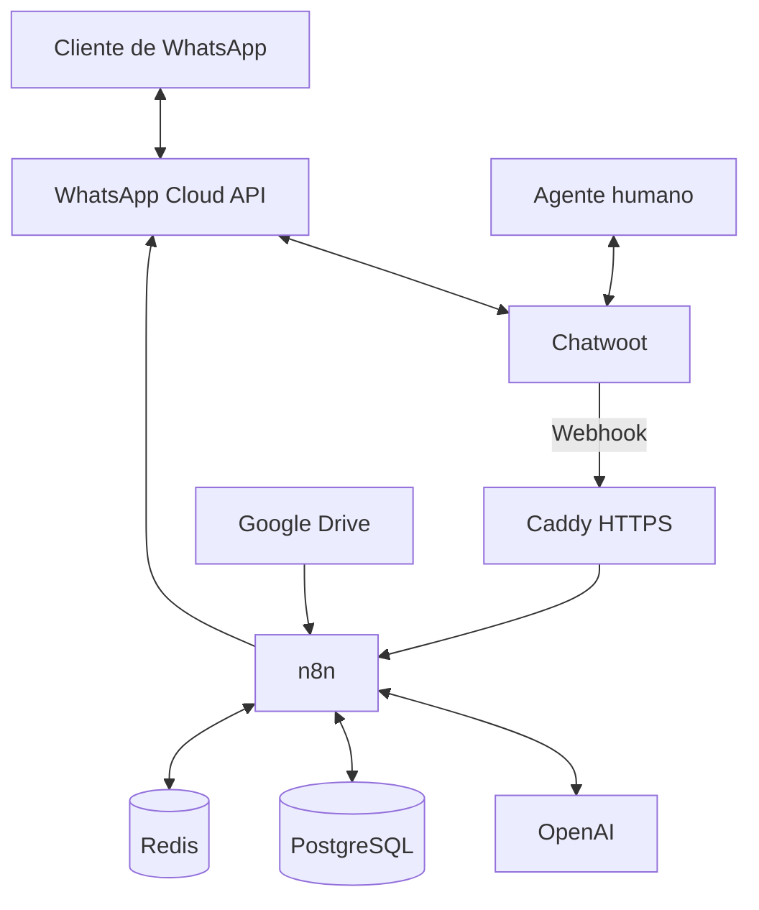
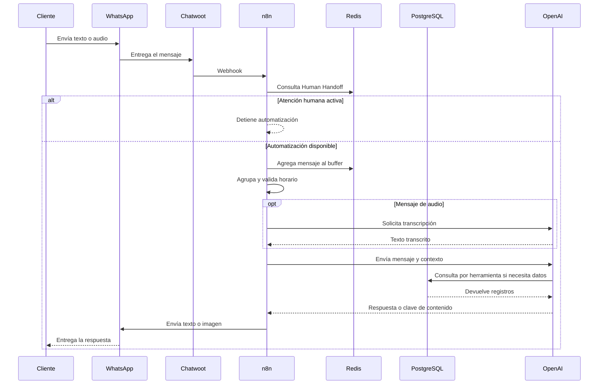

# Arquitectura del sistema

## Vista general

## Flujo de un mensaje

## Capas

| Capa | Componentes | Responsabilidad |
|---|---|---|
| Canal | WhatsApp Cloud API | Entrada y salida de mensajes |
| Atención | Chatwoot | Bandeja, contactos y agentes humanos |
| Orquestación | n8n | Reglas, integraciones y agente de IA |
| Inteligencia | OpenAI | Transcripción y generación de respuestas |
| Persistencia | PostgreSQL | Datos empresariales y memoria |
| Estado temporal | Redis | Buffer, bloqueo humano y coordinación |
| Fuente de datos | Google Drive | Archivo que alimenta `bd_clientes` |
| Exposición | Caddy | HTTPS y reverse proxy |

## Red y exposición

Todos los contenedores pertenecen a `platform_net`. Solo Caddy publica puertos:

- `80/tcp` para redirección y validación de certificados;
- `443/tcp` para HTTPS;
- `443/udp` para HTTP/3 cuando esté disponible.

PostgreSQL, Redis, n8n y Chatwoot no deben publicar puertos directamente en producción.

## Decisiones y límites

- PostgreSQL aloja tres bases: `n8n`, `chatwoot` y `agent`.
- La plantilla usa un usuario de PostgreSQL para simplificar el despliegue. En un entorno de mayor riesgo deben crearse usuarios separados y privilegios mínimos.
- Redis usa contraseña y persistencia AOF, pero no sustituye a un sistema de colas duradero.
- El workflow depende de la estructura del webhook de Chatwoot. Una actualización del proveedor debe probarse antes de producción.
- Las imágenes Docker se parametrizan para facilitar actualizaciones controladas.
