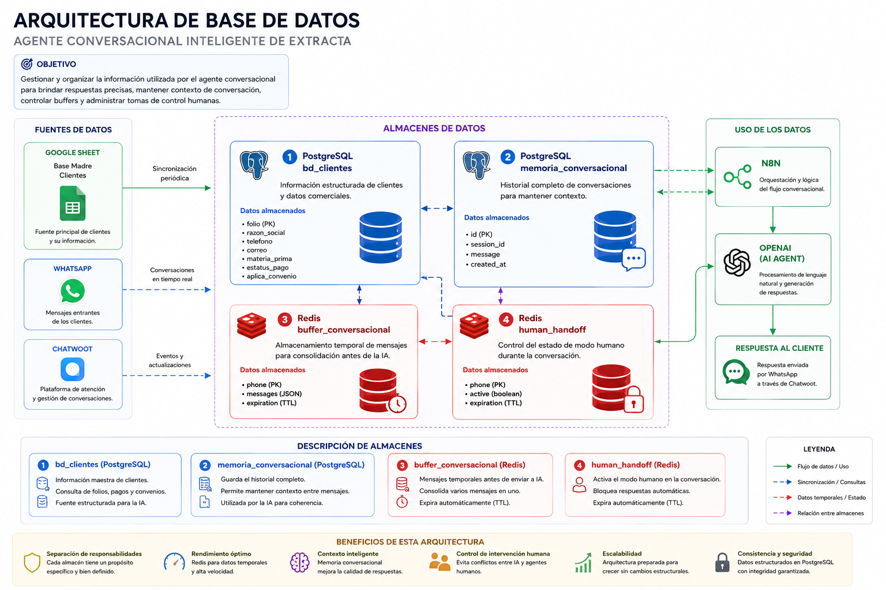

# Base de datos



## Estructura

PostgreSQL aloja tres bases lógicamente separadas:

| Base | Propósito |
|---|---|
| `n8n` | Configuración, credenciales cifradas y ejecuciones |
| `chatwoot` | Conversaciones, contactos y configuración |
| `agent` | Datos empresariales y memoria conversacional |

## Tabla `bd_clientes`

Se crea mediante [02-agent-schema.sql](../docker/initdb/02-agent-schema.sql).

| Campo | Tipo | Restricción | Descripción |
|---|---|---|---|
| `folio` | `text` | Clave primaria | Identificador del servicio |
| `razon_social` | `text` | Opcional | Cliente o empresa |
| `telefono` | `text` | Opcional, indexado | Teléfono asociado |
| `correo` | `text` | Opcional | Correo registrado |
| `materia_prima` | `text` | Opcional | Muestra o producto |
| `estatus_pago` | `text` | Opcional | Estado del pago |
| `aplica_convenio` | `text` | Opcional | Convenio comercial |
| `updated_at` | `timestamptz` | Predeterminado `now()` | Última actualización |

Ejemplo ficticio:

```sql
INSERT INTO bd_clientes (
  folio, razon_social, telefono, correo, materia_prima,
  estatus_pago, aplica_convenio
) VALUES (
  'DEMO-2026-0001', 'Cliente de prueba', '520000000000',
  'demo@example.com', 'Muestra de prueba', 'PENDIENTE', 'NO'
)
ON CONFLICT (folio) DO UPDATE SET
  estatus_pago = EXCLUDED.estatus_pago,
  updated_at = now();
```

## Memoria conversacional

El nodo `Postgres Chat Memory` crea o utiliza una tabla compatible con la versión instalada de n8n. En el workflow revisado la sesión se identifica mediante el teléfono.

Recomendaciones:

- usar un identificador no reutilizable cuando sea posible;
- definir una política de retención;
- evitar guardar información innecesaria;
- comprobar que un agente no pueda consultar conversaciones ajenas;
- no crear manualmente la tabla sin verificar el esquema esperado por la versión del nodo.

## Acceso

Desde el contenedor:

```bash
docker compose --env-file .env -f docker/docker-compose.yml \
  exec postgres sh -lc 'psql -U "$POSTGRES_USER" -d agent'
```

Comprobaciones:

```sql
\dt
SELECT count(*) FROM bd_clientes;
SELECT folio, estatus_pago, updated_at
FROM bd_clientes
ORDER BY updated_at DESC
LIMIT 10;
```

## Migraciones

Los scripts de `docker/initdb/` solo se ejecutan cuando el volumen de PostgreSQL se crea por primera vez. Para entornos existentes:

1. crea un respaldo;
2. aplica el cambio manualmente o mediante una herramienta de migración;
3. registra la fecha y versión;
4. prueba lectura y escritura;
5. conserva un procedimiento de reversión.

## Retención sugerida

La organización debe definirla según su base legal. Como punto de partida:

- ejecuciones exitosas de n8n: retención corta;
- ejecuciones con error: suficiente para diagnóstico;
- memoria conversacional: solo el periodo necesario para atención;
- respaldos: cifrados y con caducidad;
- datos de clientes: según contrato y regulación aplicable.
