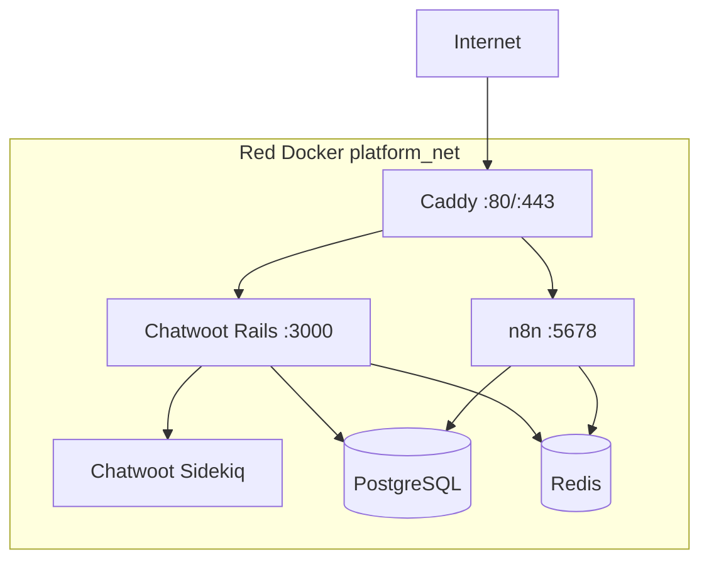

# Despliegue

## Topología



## Archivos

- `docker/docker-compose.yml.example`: stack completo.
- `docker/Caddyfile.example`: rutas HTTPS.
- `docker/initdb/`: bases y esquema inicial.
- `.env.example`: inventario de configuración.
- Los Compose separados son referencias para despliegues modulares.

## Procedimiento de release

1. Define versión y alcance.
2. Revisa que no haya secretos ni datos reales en el cambio.
3. Crea respaldo de PostgreSQL, Redis y volúmenes.
4. Ejecuta `docker compose config`.
5. Descarga imágenes con `docker compose pull`.
6. Aplica el despliegue con `docker compose up -d`.
7. Revisa salud y logs.
8. Ejecuta pruebas críticas.
9. Registra versión, fecha, responsable y resultado.

Comandos:

```bash
docker compose --env-file .env -f docker/docker-compose.yml config
docker compose --env-file .env -f docker/docker-compose.yml pull
docker compose --env-file .env -f docker/docker-compose.yml up -d
docker compose --env-file .env -f docker/docker-compose.yml ps
```

## Reversión

Si una actualización falla:

1. desactiva el workflow si genera respuestas incorrectas;
2. restaura las etiquetas anteriores en `.env`;
3. ejecuta `docker compose up -d`;
4. restaura base o volumen solo si hubo una migración incompatible;
5. repite pruebas;
6. documenta el incidente.

No uses `docker compose down -v` en producción: elimina volúmenes.

## Separación de entornos

Producción y pruebas deben usar:

- dominios distintos;
- cuentas o números de WhatsApp distintos;
- bases y volúmenes distintos;
- credenciales distintas;
- archivos de datos distintos.

No pruebes respuestas experimentales con clientes reales.

## Escalamiento

La plantilla está orientada a una sola máquina. Antes de escalar:

- mide CPU, RAM, disco y duración de ejecuciones;
- configura modo cola de n8n si el volumen lo requiere;
- separa PostgreSQL y Redis;
- añade almacenamiento compatible para archivos;
- diseña alta disponibilidad;
- incorpora monitoreo y alertas.
