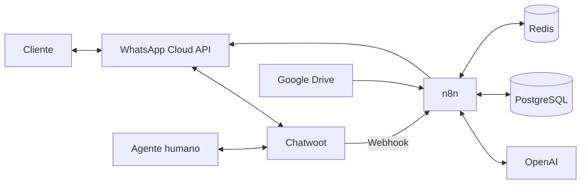

# Arquitectura general

## Lectura

- WhatsApp es el canal del cliente.
- Chatwoot centraliza conversaciones e intervención humana.
- n8n aplica las reglas y coordina integraciones.
- Redis mantiene estado temporal.
- PostgreSQL conserva datos y memoria.
- OpenAI procesa audio y lenguaje.
- Google Drive alimenta la tabla empresarial.

La explicación completa está en [Arquitectura](../arquitectura.md).
