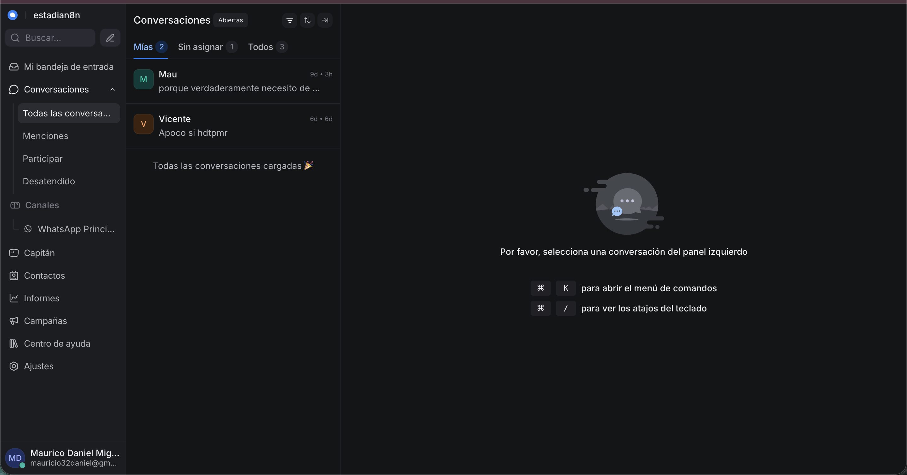

# Instalación

Esta guía describe una instalación inicial en un VPS Ubuntu 24.04 LTS. Adapta firewall, usuarios y rutas a tu proveedor.

## 1. Requisitos

- 2 CPU y 4 GB de RAM como punto de partida para pruebas.
- Almacenamiento persistente y espacio para respaldos.
- Docker Engine y Docker Compose v2.
- Dos dominios con registros A/AAAA hacia el servidor.
- Puertos 22, 80 y 443 permitidos por el firewall.
- Credenciales de Meta, OpenAI y Google Drive.

La capacidad real depende del volumen de conversaciones, retención de ejecuciones y tamaño de archivos.

## 2. Preparar el servidor

```bash
sudo apt update
sudo apt upgrade -y
sudo apt install -y ca-certificates curl git openssl
```

Instala Docker desde su repositorio oficial o mediante el procedimiento aprobado por tu organización. Verifica:

```bash
docker --version
docker compose version
```

Evita ejecutar servicios de aplicación como `root`. Si agregas tu usuario al grupo `docker`, recuerda que ese grupo concede privilegios elevados sobre el servidor.

## 3. Obtener el repositorio

```bash
git clone <URL_DEL_REPOSITORIO>
cd n8n-whatsapp-ai-agent
```

## 4. Configurar variables

```bash
cp .env.example .env
cp docker/docker-compose.yml.example docker/docker-compose.yml
```

Edita `.env` y reemplaza:

- todos los valores `CHANGE_ME`;
- dominios de ejemplo;
- URLs de imágenes;
- ID del archivo de Google Drive;
- versiones de imágenes que hayas validado.

Comprueba que no queden valores pendientes:

```bash
grep -nE 'CHANGE_ME|example\.com' .env
```

La salida debe estar vacía, salvo que una URL de ejemplo sea intencional.

## 5. Configurar DNS

Crea:

```text
n8n.example.com   -> IP_DEL_SERVIDOR
chat.example.com  -> IP_DEL_SERVIDOR
```

Verifica:

```bash
getent hosts n8n.example.com
getent hosts chat.example.com
```

Caddy necesita acceso público a 80 y 443 para HTTPS automático.

## 6. Validar Compose

Desde la raíz del repositorio:

```bash
docker compose \
  --env-file .env \
  -f docker/docker-compose.yml \
  config
```

No continúes si aparecen variables vacías, errores de sintaxis o etiquetas no disponibles.

## 7. Iniciar servicios

```bash
docker compose \
  --env-file .env \
  -f docker/docker-compose.yml \
  up -d
```

Consulta estado:

```bash
docker compose \
  --env-file .env \
  -f docker/docker-compose.yml \
  ps
```

La primera ejecución crea las bases `n8n`, `chatwoot` y `agent`. Los scripts de inicialización no vuelven a ejecutarse sobre un volumen existente.

## 8. Revisar logs

```bash
docker compose --env-file .env -f docker/docker-compose.yml logs --tail=100 postgres
docker compose --env-file .env -f docker/docker-compose.yml logs --tail=100 chatwoot-prepare
docker compose --env-file .env -f docker/docker-compose.yml logs --tail=100 n8n
docker compose --env-file .env -f docker/docker-compose.yml logs --tail=100 caddy
```

## 9. Inicializar aplicaciones

### Chatwoot

Abre `https://CHATWOOT_DOMAIN`, crea la cuenta administrativa y configura la bandeja de WhatsApp siguiendo la documentación oficial.



### n8n

Abre `https://N8N_DOMAIN`, crea el propietario inicial y configura:

- OpenAI;
- PostgreSQL con host `postgres` y base `agent`;
- Redis con host `redis`;
- WhatsApp Business Cloud;
- Google Drive OAuth2.

## 10. Importar workflow

Importa:

```text
workflows/My workflow 2.json
```

Después:

1. confirma que está desactivado;
2. asigna todas las credenciales;
3. revisa los nodos marcados con error;
4. reemplaza textos y precios por información aprobada;
5. verifica el webhook de producción;
6. ejecuta pruebas manuales por ramas.

## 11. Configurar webhooks

Chatwoot debe enviar eventos al webhook de producción de n8n:

```text
https://N8N_DOMAIN/webhook/whatsapp-chatwoot
```

No confundas la URL de prueba `/webhook-test/` con la URL de producción `/webhook/`.

La configuración exacta de Meta y Chatwoot depende del canal elegido. Documenta en tu inventario:

- aplicación de Meta;
- WhatsApp Business Account ID;
- Phone Number ID;
- URL y eventos del webhook;
- bandeja de Chatwoot;
- responsables y fecha de rotación.

## 12. Validar datos

```bash
docker compose --env-file .env -f docker/docker-compose.yml \
  exec postgres sh -lc 'psql -U "$POSTGRES_USER" -d agent -c "\\dt"'
```

## 13. Activación

No actives el workflow hasta completar:

- [Pruebas](pruebas.md);
- [Seguridad](seguridad.md);
- un respaldo inicial;
- una prueba de restauración;
- monitoreo básico de disponibilidad y disco.

## Actualizaciones

Antes de cambiar una imagen:

1. lee notas de versión y cambios incompatibles;
2. crea respaldo;
3. prueba en staging;
4. actualiza una versión a la vez;
5. ejecuta la matriz de pruebas;
6. conserva una ruta de reversión.
