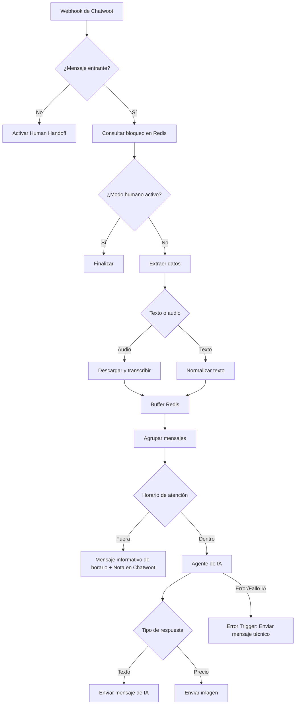

# Workflows de n8n

El repositorio incluye [un workflow de ejemplo saneado](../workflows/My%20workflow%201.json). Se entrega desactivado y sin credenciales asignadas.

## Dependencias

Antes de importarlo deben existir credenciales de:

- OpenAI;
- PostgreSQL, apuntando a la base `agent`;
- Redis;
- WhatsApp Business Cloud;
- HTTP Header Auth para descargar medios de WhatsApp;
- Google Drive OAuth2.

El archivo también usa variables de entorno definidas en [.env.example](../.env.example).

## Flujo principal



## Reglas importantes

### Evitar bucles

El nodo `msg_from_client` solo deja pasar mensajes `incoming`. Los mensajes salientes activan el estado humano porque representan intervención desde Chatwoot.

### Audio

La descarga de medios usa Graph API y una credencial `HTTP Header Auth` de n8n. El token no debe escribirse directamente en el nodo ni en el JSON exportado.

### Buffer

La lista se identifica actualmente con el teléfono del remitente. Para evitar colisiones se recomienda el formato:

```text
buffer:<account_id>:<conversation_id>
```

El workflow actual debe probarse con mensajes simultáneos antes de aumentar tráfico.

### Horario y Fuera de Horario

La regla de horario usa `America/Mexico_City`, de lunes a viernes, de 08:00 a 16:59.
* Si el cliente escribe fuera de horario: se le envía su mensaje respectivo de WhatsApp y **se genera una nota privada automática en Chatwoot** para alertar a los asesores del intento de contacto al día siguiente.

### Agente de IA

El agente:

- mantiene una ventana de contexto de 20 mensajes;
- consulta `bd_clientes` cuando recibe un folio;
- devuelve claves especiales para seleccionar imágenes;
- no debe inventar precios, resultados ni estados.

### Manejo de Errores (Resiliencia)

El flujo cuenta con un nodo `Error Trigger` global. Si el proveedor de IA (OpenAI) experimenta fallos o timeouts, el bot envía automáticamente un mensaje de disculpa al cliente para no dejarlo sin respuesta, protegiendo la experiencia de usuario.

### Optimización de Base de Datos y Redis

* **Sincronización Consolidada:** Se utiliza un único `Google Drive Trigger` que centraliza la carga y actualización de todas las tablas de negocio en PostgreSQL, evitando ejecuciones y duplicaciones de procesamiento.
* **Payload Redis Limpio:** El nodo `Code in JavaScript2` procesa y filtra el payload de Chatwoot antes de guardarlo en Redis. En lugar de almacenar todo el objeto completo (que incluye metadatos extensos de la cuenta), solo guarda la estructura básica (`phone`, `content`, `attachments`). Esto ahorra hasta un 90% de almacenamiento en la memoria del buffer.
* **Límite de Catálogo Extendido:** La herramienta `Centro Operativo` ejecuta consultas SQL con `LIMIT 15` (antes 5), permitiendo que la IA analice un espectro de conocimiento más amplio y preciso a medida que el catálogo de análisis crece.

## Importación segura

1. Importa el JSON.
2. Confirma que aparece desactivado.
3. Asigna cada credencial manualmente.
4. Revisa variables y URLs.
5. Sustituye precios y mensajes por datos aprobados.
6. Ejecuta cada rama con datos ficticios.
7. Actívalo solo después de completar [Pruebas](pruebas.md).

## Riesgos conocidos

- El export conserva lógica y textos de negocio; deben revisarse antes de reutilizarse.
- El webhook depende del payload de Chatwoot.
- La versión de Graph API debe actualizarse de forma planificada.
- Las variables `$env` pueden estar restringidas según la configuración o versión de n8n; si ocurre, usa credenciales o variables administradas desde n8n.
- Se implementó un control local de errores para la IA, pero se recomienda estructurar un flujo global secundario para fallos generales del servidor n8n.

