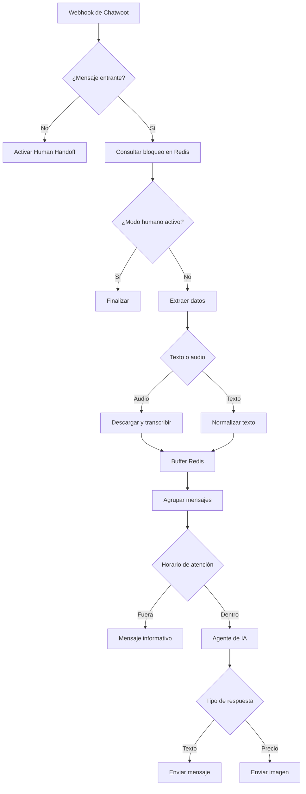

# Workflows de n8n

El repositorio incluye [un workflow de ejemplo saneado](../workflows/atencion-whatsapp-principal.example.json). Se entrega desactivado y sin credenciales asignadas.

## Dependencias

Antes de importarlo deben existir credenciales de:

- OpenAI;
- PostgreSQL, apuntando a la base `agent`;
- Redis;
- WhatsApp Business Cloud;
- HTTP Header Auth para descargar medios de WhatsApp;
- Google Drive OAuth2.

El archivo también usa variables de entorno definidas en [.env.example](../.env.example).

## Flujo principal



## Reglas importantes

### Evitar bucles

El nodo `msg_from_client` solo deja pasar mensajes `incoming`. Los mensajes salientes activan el estado humano porque representan intervención desde Chatwoot.

### Audio

La descarga de medios usa Graph API y una credencial `HTTP Header Auth` de n8n. El token no debe escribirse directamente en el nodo ni en el JSON exportado.

### Buffer

La lista se identifica actualmente con el teléfono del remitente. Para evitar colisiones se recomienda el formato:

```text
buffer:<account_id>:<conversation_id>
```

El workflow actual debe probarse con mensajes simultáneos antes de aumentar tráfico.

### Horario

La regla usa `America/Mexico_City`, de lunes a viernes, de 08:00 a 16:59. Los días festivos no están modelados.

### Agente

El agente:

- mantiene una ventana de contexto de 10 mensajes;
- consulta `bd_clientes` cuando recibe un folio;
- devuelve claves especiales para seleccionar imágenes;
- no debe inventar precios, resultados ni estados.

## Sincronización de datos

El mismo archivo contiene una rama que observa un XLSX de Google Drive:

1. detecta cambios;
2. descarga el archivo;
3. extrae las filas;
4. ejecuta un `upsert` por `folio` en `bd_clientes`.

El encabezado esperado del archivo es:

| Columna XLSX | Campo PostgreSQL |
|---|---|
| `Folio` | `folio` |
| `Razon_Social` | `razon_social` |
| `Telefono` | `telefono` |
| `Correo` | `correo` |
| `Materia_Prima` | `materia_prima` |
| `Estatus_Pago` | `estatus_pago` |
| `Aplica_Convenio` | `aplica_convenio` |

## Importación segura

1. Importa el JSON.
2. Confirma que aparece desactivado.
3. Asigna cada credencial manualmente.
4. Revisa variables y URLs.
5. Sustituye precios y mensajes por datos aprobados.
6. Ejecuta cada rama con datos ficticios.
7. Actívalo solo después de completar [Pruebas](pruebas.md).

## Riesgos conocidos

- El export conserva lógica y textos de negocio; deben revisarse antes de reutilizarse.
- El webhook depende del payload de Chatwoot.
- La versión de Graph API debe actualizarse de forma planificada.
- Las variables `$env` pueden estar restringidas según la configuración o versión de n8n; si ocurre, usa credenciales o variables administradas desde n8n.
- No existe todavía un workflow separado de manejo global de errores.
